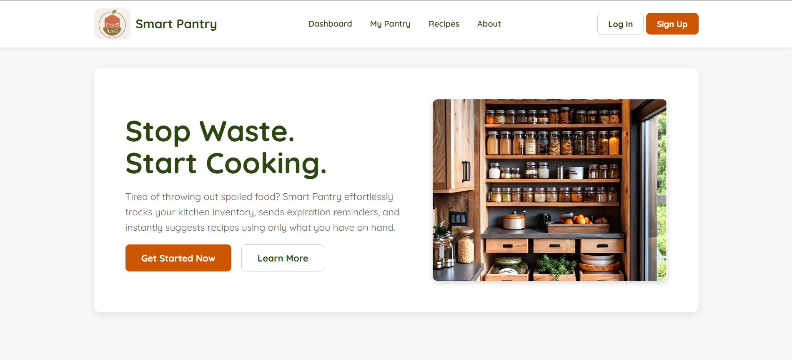
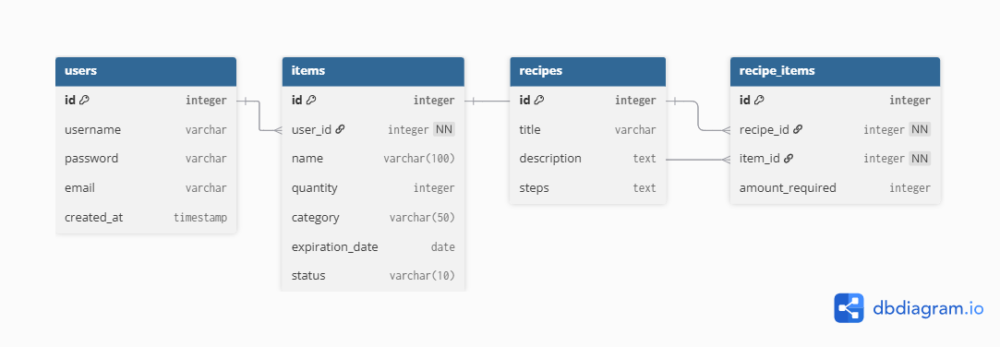

# Capstone-Project
# Smart Pantry

## 1. Project Description
**Smart Pantry** is a web application that helps users efficiently organize and manage their kitchen inventory. Users can log grocery items, track expiration dates, and receive suggestions for recipes based on the ingredients they currently have.  

The main goal of the application is to reduce food waste, make meal planning easier, and improve daily kitchen management. The interface is designed to be clean, warm, and user-friendly, providing practical features that address real household challenges.

---

## 2. User Stories
1. As a user, I want to register and log in so that I can manage my personal pantry.  
2. As a user, I want to add new items with their name, quantity, category, and expiration date so I can keep track of them.  
3. As a user, I want to edit or delete existing items so my inventory stays up-to-date.  
4. As a user, I want to view a list of items sorted by expiration date so I can use them before they expire.  
5. As a user, I want to categorize my items (e.g., vegetables, dairy, canned goods) to find things faster.  
6. As a user, I want to link items to recipes so I know what ingredients are needed.  
7. As a user, I want to see a list of recipes I can make with what I currently have in my pantry.  
8. As a user, I want a clean, warm, and easy-to-use kitchen-themed interface.  

---

## 3. Features
- User authentication (register/login).  
- Add, edit, and delete pantry items.  
- Track expiration dates with visual warnings for items nearing expiry.  
- Categorize items for faster searching.  
- View items sorted by expiration date.  
- Suggest recipes based on the items currently in the pantry.  
- Clean and intuitive kitchen-themed user interface.  

---

## 4. ERD (Entity Relationship Diagram)

---

## 5. Technologies

- **Backend:** Django  
- **Frontend:** HTML, CSS  
- **Database:** PostgreSQL  
- **Version Control:** Git, GitHub  
- **Other Tools:** dbdiagram.io for ERD visualization  
- **AI Integration:** Gemini API (for recipe generation)

---

## 6. Local Setup / Running the Project:
1. Fork and Clone the repository

<pre>
<code>
git clone https://github.com/NoorAbdin/Capstone-Project.git
cd Capstone-Project
</code>
</pre>
<button onclick="navigator.clipboard.writeText('git clone https://github.com/NoorAbdin/Capstone-Project.git\ncd Capstone-Project')">Copy</button>

2. Initialize a new virtual environment

<pre>
<code>
pipenv install 
</code>
</pre>
<button onclick="navigator.clipboard.writeText('pipenv install')">Copy</button>

3. Activate the virtual environment

<pre>
<code>
pipenv shell
</code>
</pre>
<button onclick="navigator.clipboard.writeText('pipenv shell')">Copy</button>

4. Setup Environment Variables

<pre>
<code>
SECRET_KEY=your_secret_key_here
DB_NAME=smartpantry
DB_USER=postgres
DB_PASSWORD=your_password
DB_HOST=localhost
DB_PORT=5432
EMAIL_HOST_USER=your_email@gmail.com
EMAIL_HOST_PASSWORD=your_app_password
API_KEY=your_gemini_api_key
</code>
</pre>
<button onclick="navigator.clipboard.writeText(`SECRET_KEY=your_secret_key_here\nDB_NAME=smartpantry\nDB_USER=postgres\nDB_PASSWORD=your_password\nDB_HOST=localhost\nDB_PORT=5432\nEMAIL_HOST_USER=your_email@gmail.com\nEMAIL_HOST_PASSWORD=your_app_password\nAPI_KEY=your_gemini_api_key`)">Copy</button>

5. Connecting to the Database

<pre>
<code>
pipenv install psycopg2-binary
createdb databasename
</code>
</pre>
<button onclick="navigator.clipboard.writeText('pipenv install psycopg2-binary .\ncreatedb <databasename>')">Copy</button>

6. Apply Database Migrations

<pre>
<code>
python smartpantry/manage.py makemigrations
python smartpantry/manage.py migrate
</code>
</pre>
<button onclick="navigator.clipboard.writeText('python manage.py makemigrations\npython manage.py migrate')">Copy</button>

7. Run the Development Server

<pre>
<code>
python smartpantry/manage.py runserver
</code>
</pre>
<button onclick="navigator.clipboard.writeText('python manage.py runserver')">Copy</button>

## 7. Timeline (1 Week)

| Day   | Tasks                                                                    |
|-----  |------------------------------------------------------------------------- |
| Day 1 | Project setup, database design, and creating models                      |
| Day 2 | Implement user authentication                                            |
| Day 3 | Implement item expiration sorting and warnings and basic CRUD for items  |
| Day 4 | Create recipe suggestions and link items to recipes                      |
| Day 5 | UI design and styling (clean, warm kitchen-themed interface)             |
| Day 6 | Dashboard and Manage account , Testing                                   |
| Day 7 |  deployment and final project documentation/review/presentation          |

---

## 8. Challenges
During the development of **Smart Pantry**, several challenges were encountered:  

- **AI Integration:** Learning how to use the **Gemini API** for recipe generation and handling API rate limits and errors.  
- **Ingredient Matching:** Ensuring recipes only link to items available in the user's pantry and handling case-insensitive matches.  
- **Expiration Logic:** Correctly calculating items expiring soon and providing visual warnings without affecting performance.  
- **User Experience:** Designing a clean, warm, and intuitive UI that works across devices.  
- **Error Handling:** Providing meaningful feedback for invalid forms, missing ingredients, or API errors.  

---

## 9. Wins
Some highlights and successes of the project:  

- Successfully integrated **Gemini API** to generate recipes dynamically based on user-selected ingredients.  
- Implemented full CRUD functionality for pantry items, including expiration tracking and categorization.  
- Created a dashboard that displays items expiring soon and suggested recipes.  
- Developed a responsive, kitchen-themed interface that is user-friendly and visually appealing.  
- Implemented user authentication, account management, and secure password handling.  

---

## 10. Key Learnings
Through building this project, the following key lessons were gained:  

- Practical experience in **Django** for full-stack web development.  
- Integrating third-party APIs (**Gemini AI**) and handling schema-based responses.  
- How to structure a relational database with multiple relationships (**One-to-Many**, **Many-to-Many**) in Django.  
- Importance of **user experience and responsive design** in application usability.  
- How to handle errors gracefully and provide meaningful feedback to users.  
- Effective use of **environment variables** for secure credentials and API keys.  
- Strengthened skills in **problem-solving, debugging, and project planning** from start to finish.

---

## 11. Future Work
In future versions of **Smart Pantry**, the following features can be added:  

- **Notifications/Alerts:** Notify users when items are nearing expiration to further reduce food waste.  
- **Shopping List:** Allow users to create and manage shopping lists based on items they need to restock.  
- **User-Created Recipes:** Enable users to create and save their own recipes, linking them to pantry items for easier planning.  
- **Advanced Filtering/Sorting:** Filter items by category, expiration date, or quantity for faster management.  
- **Favorites and History:** Allow users to mark favorite recipes and track frequently used items.  
